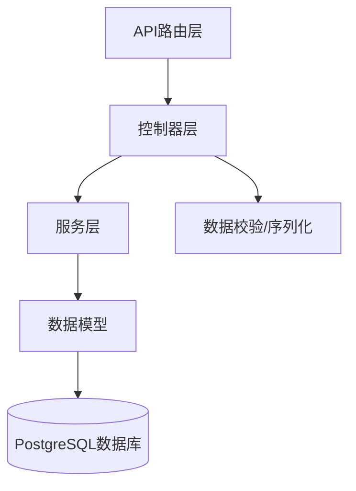
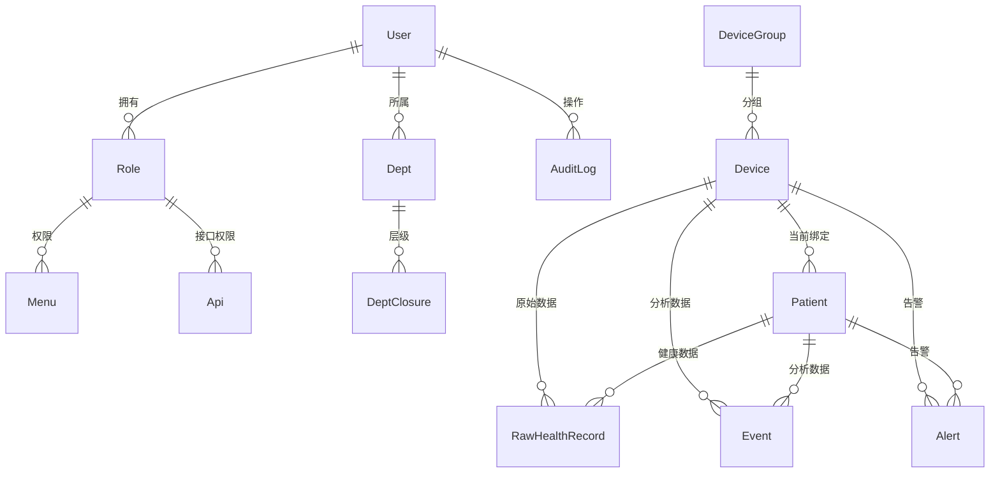

# 后端架构与ER图说明

## 技术路线

- 框架：FastAPI
- ORM：Tortoise ORM
- 数据库：PostgreSQL
- 主要目录结构：
  - `app/models/`：数据模型（健康、用户、权限、设备等）
  - `app/schemas/`：数据结构校验与序列化
  - `app/controllers/`：业务逻辑
  - `app/service/`：服务层（MQTT、WS等）
  - `app/api/`：路由分发
  - `app/settings/`：配置管理

## 架构分层

## 主要数据模型与ER关系

## 典型模型字段举例

- **User**
  - username, email, is_active, is_superuser, dept_id, roles
- **Role**
  - name, desc, menus, apis
- **Dept**
  - name, parent_id, order, leader
- **Device**
  - device_id, current_patient, group
- **Patient**
  - name, gender, birthday
- **RawHealthRecord**
  - device, patient, recorded_at, data_type, value
- **Event**
  - device, patient, recorded_at, analysis_type, result
- **Alert**
  - device, patient, alert_type, created_at, status

## 优化建议

- 领域模型进一步拆分，减少耦合
- 健康数据表建议分区或归档，提升查询性能
- 权限与菜单关系可用多对多表优化
- 设备与分组支持灵活扩展
- 增加审计日志与数据追溯能力

---
如需详细字段或业务流程梳理，可进一步补充。